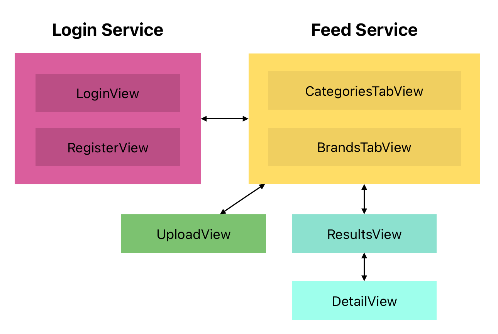

# MyCloset Assistant

## Table of Contents
1. [Overview](#Overview)
1. [Product Spec](#Product-Spec)

## Overview
### Description
MyCloset Assistant is an app that helps users categorize andstore their closet items. Many people have been guilty of buying similar or the same articles of clothing, but this app will help users view their closets virtually and help them decide if they should buy clothes.

### App Evaluation

- **Category:** Fashion, Lifestyle
- **Mobile:** Smartphone
- **Story:** Allows users to organize their clothing items by uploading pictures of the clothes to the app. Allows users to look through their digital closet 
- **Market:** App Store

## Product Spec

### 1. User Stories (Required and Optional)

**Required Must-have Stories**

- [X] As a user, I can signup for a new account.
- [X] As a user, I can login to my account.
- [X] As a user, I can take and upload pictures to MyCloset Assistant.
- [X] As a user, I can assign a category to my clothes.
- [X] As a user, I can organize my clothes based on different categories.
- [ ] As a user, I can delete any clothing items from my closet. 

### 2. Screen Archetypes

* LoginView
   * Fields to login to an existing account.
   * Button to login with fields provided. (shows CategoriesTab)
   * Button to register for a new account. (shows RegisterView)
* RegisterView
   * Fields to register for a new account.
   * Button to register with fields provided. (shows CategoriesTab)
* CategoriesTab (tab of HomeViewNavigation)
   * Grid of buttons with different categories (shows ResultsView)
   * Button to upload a new item
   * Tabs with self and brands (Self, BrandsTab)
* BrandsTab (tab of HomeViewNavigation)
   * Grid of buttons with different brands (shows ResultsView)
   * Tabs with self and brands (Self, BrandsTab)
* UploadView
   * Fields to upload a new ClothingItem
   * Button to finish uploading (pops off self)
* DetailView
   * Information for a selected ClothingItem
   * Back button (pops off self)
   * Delete item button (pops off self)
* ResultsView
   * Grid of images from each ClothingItem in closet (shows DetailView)
   * Back button (pops self)

### 3. Navigation

**Tab Navigation**

* Categories
* Brands

**App Architecture**

## Models
### Gender
Variant name|
---|
male|
female|
other|

## ClothingItem
Field name|Field type
---|---
name|`String`
categories|`[String]`
imageFile|`ParseFile`
brand|`String`
size|`String`
notes|`String?`
... ParseObject fields|

## User
Field name|Field type
---|---
gender|`Gender`
closet|`[ClothingItem]`
categories|`[String]`
brands|`[String]`
username|`String`
email|`String`
password|`String`
... ParseUser fields|
